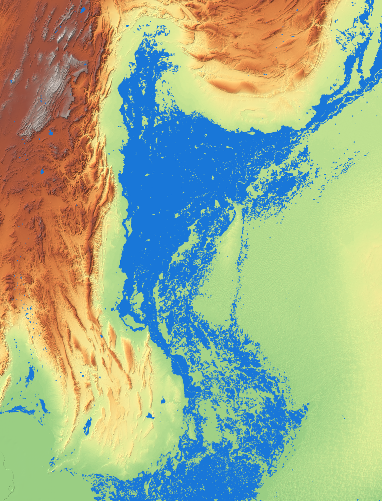

# Sindh 2022 Flood — 3D Observed Replay

An interactive 3D reconstruction of the 2022 Indus flood across Sindh and south-east
Balochistan, built on satellite-observed flood extents rather than a scripted animation.

AOI: **66.09–70.66°E, 26.20–32.20°N** — the full Sulaiman Range in the north, with
Qazi Ahmad (26.303°N) as the downstream limit.

The timeline runs as one continuous calendar from **1 June 2022 to 28 February 2023**.
Everything from 21 July onward is measured; the stretch before it is a reconstruction
and is labelled as such on screen.



---

## Running it

No build step. Serve the `web/` directory over HTTP — ES modules and `fetch` will not
work from `file://`.

```bash
python3 -m http.server 8777 --directory web
```

Then open <http://localhost:8777>.

Three.js r169 is vendored in `web/vendor/`, so there are no CDN dependencies and it
runs offline.

---

## What it shows

**Terrain** — SRTM elevation over the AOI, drawn as a solid block
with a hypsometric and hillshade drape. Vertical exaggeration is adjustable and reads
as a true multiplier, because world units are kilometres.

**Two water tracks**, kept separate rather than merged:

| Track | Sensors | Resolution | Frames | Coverage |
|---|---|---|---|---|
| `viirs` | VIIRS / MODIS | 375 m | 12, weekly | Full frame |
| `highres` | Sentinel-1, Sentinel-2, Landsat-8 | 10–30 m | 5, August only | 22–40% of frame |

They disagree by roughly 1.3–1.7× on flooded area, and neither is wrong — VIIRS flags a
whole 375 m pixel if part of it is wet. Blending them into one series produced step
changes of +14,000 km² that were pure sensor-switch artefact, so each track is built
independently and cross-compared instead.

**Observed area, VIIRS track**

| Date | Flooded |
|---|---|
| 2022-07-21 | 9,750 km² |
| **2022-08-31** | **38,462 km² (peak)** |
| 2022-10-17 | 17,003 km² |
| 2022-12-31 | 6,700 km² |
| 2023-02-28 | 2,740 km² |

Peak-extent envelope over the whole event: **42,049 km²**.

**Cross-validation** — high-resolution vs VIIRS, inside each high-resolution footprint:

| Date | Sensor | High-res | VIIRS | Ratio | IoU |
|---|---|---|---|---|---|
| 08-27 | S1 | 8,887 km² | 13,644 km² | 1.54 | 0.508 |
| 08-29 | LS8 | 1,845 km² | 2,345 km² | 1.27 | 0.523 |
| 08-31 | S2 | 11,062 km² | 16,989 km² | 1.54 | 0.581 |

---

## Reconstructed vs observed

The satellite record begins on 21 July 2022. The monsoon build-up and the hill-torrent
response before that date are **reconstructed**. The timeline marks that stretch with a
hatched band, and the HUD names the inputs (CHIRPS rainfall, DEM-routed torrents)
rather than a satellite.

- **Rainfall is measured.** CHIRPS daily totals drive rain intensity, cloud shadow, sky
  colour and ground wetness. Peak area-mean was 17.22 mm/day (2022-07-06);
  the wettest cells took ~568 mm over the season.
- **Channel geometry is measured topography.** Nai channels are traced from the DEM by
  priority-flood depression filling, D8 flow routing and flow accumulation — not drawn
  by hand.
- **Surge timing is a model.** A kinematic wave with celerity scaling as √slope, so
  torrents run fast down the Kirthar and Sulaiman ravines and slow on the plain.

Channels are restricted to terrain with more than 80 m of local relief. On the
irrigated plain the real drainage is canals and bunds a few metres deep, far below what
a 270 m DEM resolves, and routing there invents a dense dendritic network that looks
convincing and means nothing. The plain is left to the observed data.

---

## Honesty in the rendering

The satellite record is patchy, and the app is built not to paper over that:

- **Unobserved ground is never drawn as dry.** A single satellite pass covers roughly
  20% of the frame. Pixels no sensor has yet seen render as grey haze, and the HUD
  warns when a track's coverage falls below 60%.
- **Stale readings fade.** Each frame carries a per-pixel age; a carried-forward
  reading is drawn progressively paler so it cannot be mistaken for a fresh
  measurement.
- **Reconstruction is distinguished** from measurement on the timeline and in the HUD
  source line, so a reader can tell which is which.

---

## Pipeline

Scripts are ordered; each writes into `web/assets/`.

| Script | Does |
|---|---|
| `fetch_dem.py` | Mosaics AWS Terrarium SRTM tiles over the frame → `dem_sindh_z10.tif` |
| `fetch_unosat.py` | Downloads UNOSAT flood geodatabases from HDX (~2.3 GB) |
| `composite.py` | Builds the two-track flood composite and the peak envelope |
| `fetch_chirps.py` | CHIRPS daily rainfall, clipped to frame → `chirps_frame.npz` |
| `flow_routing.py` | DEM flow routing → `arrival.png` (channels + arrival times) |
| `fetch_places.py` | GeoNames settlements in frame → `places.json` |
| `local_layers.py` | Clips local GIS layers (bunds, permanent water, breach points) |
| `fetch_boundaries.py` | Province and district boundaries from the HDX Pakistan COD-AB set |
| `fetch_osm.py` | Manchar/Hamal lake polygons and built-up city extents from OpenStreetMap |
| `build_web_assets.py` | Bakes terrain, textures, frames and manifest for the browser |

Large intermediates are gitignored and regenerable — see `.gitignore`.

---

## Data sources and attribution

| Data | Source | Licence |
|---|---|---|
| Flood extents | [UNOSAT](https://unosat.org) via [HDX](https://data.humdata.org) | CC BY 3.0 IGO |
| Elevation | SRTM via [AWS Terrain Tiles](https://registry.opendata.aws/terrain-tiles/) | Public domain / ODbL for some sources |
| Rainfall | [CHIRPS v2.0](https://www.chc.ucsb.edu/data/chirps), UC Santa Barbara | Public domain |
| Settlements | [GeoNames](https://www.geonames.org) | CC BY 4.0 |
| Admin boundaries | [OCHA COD-AB via HDX](https://data.humdata.org/dataset/cod-ab-pak) | CC BY-IGO |
| Lakes, city extents | [OpenStreetMap](https://www.openstreetmap.org) via Overpass | ODbL |
| Renderer | [three.js](https://threejs.org) r169 | MIT |

Bund alignments and 2022 breaching points are derived from Sindh Irrigation Department
material and are published here at the Department's direction. Check with SID before
reusing them elsewhere.

---

## Nai sub-catchments

Delineated from the DEM with the Sindh Irrigation Department's own gauging stations
as pour points (Nai Gaj uses the dam axis). Nai Baran falls outside the AOI.

| Nai | Catchment | Drains to | Gauge snap |
|---|---|---|---|
| Nai Gaj | 6,580 km² | manchar | 1.59 km |
| Nai Bhan | 1,265 km² | manchar | 5.14 km |
| Nai Pakho | 561 km² | hamal | 1.92 km |
| Nai Dugdu | 200 km² | hamal | 3.22 km |
| Nai Chandio | 123 km² | manchar | 0.6 km |
| Nai Naig | 66 km² | manchar | 3.77 km |
| Nai Khedro | 15 km² | hamal | 2.98 km |
| Nai Ranjo | 14 km² | manchar | 0.38 km |

**These are provisional.** The delineation is only as good as the pour-point
coordinates, and the ones used here come from a schematic app rather than survey data
— several gauges sat 3–5 km from any mapped channel and had to be snapped. Nai Gaj is
the right order of magnitude for a major catchment; the sub-100 km² figures are almost
certainly too small, meaning those gauges snapped onto a tributary rather than the
main Nai. Accurate gauge coordinates, or the Department's own catchment boundaries,
would replace this outright.

---

## Known limitations

- **VIIRS over-detects** relative to 10 m sensors by 1.3–1.7×. Use the high-resolution
  track where precision matters; use VIIRS for temporal shape and full coverage.
- **Labels do not test terrain occlusion**, so a town behind a ridge can still show its
  name at steep viewing angles.
- **Surge timing is uncalibrated.** No gauge data was available for the Nais, so the
  kinematic-wave timing is plausible but unverified.
- **The plain has no modelled hydraulics.** This is an observed replay, not a
  hydrodynamic model — there is no shallow-water solve, no bund overtopping physics and
  no breach routing.
